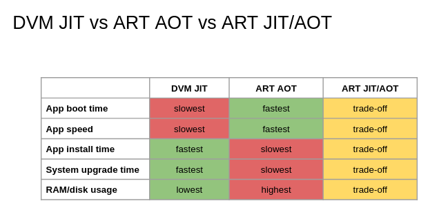

## 7 - Messing with Android apps


Apk is a zip file (kinda)

```bash
$ unzip app.apk
```

Java / Dalvik bytecode

- Cannot be run by processor.
- Can be run by VM (JVM/DVM).
- DVM: code that your processor can run, takes Dalvik bytecode as input and executes intended behaviour.
- We use virtual machine so that the same code can run across multiple devices / architectures (DVM is custom).
- There is on security benefit to having a virtual machine.

Dalvik bytecode verifier

- Checks if the bytecode is well-formed.
- Dalvik is easy to disassemble.
- Therefore bad for the bad guys.

What can bad guys do then?

- You can still obfuscate (Reflection).
- You can also load code dynamically.
- Or use native code (no such thing as native code verifier, Google NaCl doesn't apply).

Dalvik bytecode

- Knows about OO concepts.
- Dest-to-src syntax.
- Types: V void, B byte, S short, C char, I int, Z boolean.
- Classes: L&lt;fullyqualifiedclassname&gt; (ex.: Landroid.content.Intent;).
- The bytecode is nicely split in "methods" (.smali files).
- Dalvik is register-based.
- Each method has its own register "frame".
- Methods' args are placed in the last registers of the frame.
- If a method is non-static, the first argument is "this".

Register frame

Consider a method s.t.
- it takes 3 arguments
- its register frame has 6 registers

The method will use
- Registers v0, v1, v2, v3, v4, v5
- Arguments are placed in v3, v4, v5

Register model

- Different from CPU registers.
- Not shared across methods.
- Can contain values and references though.

Examples

```java
int pig(int x) {
    return 2*x;
}
```

```dalvik
.method pig(I)I
    .registers 3

    mul-int/lit8 v0, v2, 0x2

    return v0
.end method
```

```
int foo(int a, Peppa p) {
    int b = p.pig(a);
    return b;
}
```

```
.method foo(ILcom/mobisec/Peppa;)I
    .registers 5

    invoke-virtual {v4, v3}, Lcom/mobisec/Peppa;->pig(I)I
    move-result v0

    add-int v1, v3, v0
    return v1
.end method
```

Dalvik instructions [~](https://source.android.com/devices/tech/dalvik/dalvik-bytecode)

```dalvik
; moving
const v5, 0x123
move v4, v5

; arithmetic
add-int v1, v3, v0
mul-int/lit8 v0, v2, 0x2

; invocation
invoke-virtual {v4, v3}, Lcom/mobisec/Peppa;->pig(I)I
invoke-static ...
invoke-{direct, super, interface} ...

; return
move-result v5

; set / get
iget, iget-object, ...
iput, iput-object, ...
sget, sput ... (for static fields)

; new object
new-instance v2, Lcom/mobisec/Peppa;

; control flow
if-ne v0, v1, :label\_a
...
:label\_a
...
goto :label\_b

; meta
filled-new-array
```

Which component executes Dalvik?


1. In the past (uptil Android 4.4)
	- DVM, libdvm.so
	- When about to execute a method, compile and run it.
	- Compilation is done "on-demand" (Just-in-time).
	- Compiled code stored in cache.

2. Then we got Android ART (introduced in Android 5)
	- Android Run-Time replaced the old DVM (optional in Android 4.4).
	- Ahead-of-time compilation (at app installation time).
	- App boot and execution are faster, but more space required on RAM & DISK.
	- Installation takes much longer, bad repercussion on system upgrades, could take ~15 minutes.

3. New version of ART (introduced in Android 7)
	- Profiles an app and precompiles only the "hot" methods (most likely to be used).
	- Other parts of the app are left uncompiled.
	- Automatically precompiles methods "near to be used."
	- Precompilation only happens when the device is idle and charging.
	- Quick path to install / upgrade.



ODEX: optimized DEX

- dex →  _dexopt_ →  ODEX
- Faster to boot and run.
- Most system apps that start at boot are ODEXed.
- ODEX is an additional file, next to an APK.
- Device dependent.

Analogous of ODEX for ART

- The new ART uses two formats.
- The ART format (.art files):
	- pre-initialized classes / objects.
	- only one file: **boot.art**
	- contains pre-initialized memory for most of the Android framework.
- The OAT files:
	- compiled bytecode to machine code wrapped in an ELF file.
	- can contain one or more DEX files (actual Dalvik bytecode).
	- obtained with _dex2oat_ (usually run at install time).
	- you still have **.odex** files.
	- **.odex** files are OAT-formatted files!
	- one important file: **boot.oat**
	- all traditional ODEX files are OAT files.
	- can be inspected with **oatdump**.

When a new app starts

- All app processes are created by forking Zygote (init, template).
- Optimization trick: **boot.oat** is already mapped in memory, no need to reload the framework!


More information

- [stackoverflow](https://stackoverflow.com/questions/26254538/difference-between-dexopt-and-dex2oat/26263071#26263071)
- [newandroidbook](http://newandroidbook.com/files/Andevcon-ART.pdf)
- [ctf-challenge](http://reyammer.blogspot.com/2016/03/from-android-art-binary-only-to-dex-yes.html)

### Tools

#### Unpacking apks

```$ unzip app.apk```

- AndroidManifest.xml (compressed)
- classes.dex
- resources (compressed)

#### smali/baksmali

```$ baksmali classes.dex -o output```

- Disassemble DEX files.
- Output: a .smali file for each class.
- Dalvik bytecode in "smali" format.

```$ smali output -o patched.apk```

- Assembler for DEX files.

#### apktool

- embeds baksmali/smali.
- unpacks / packs APKs, including resources and manifest files.

```$ apktool d app.apk -o output```
```$ apktool b output -o patched.apk```

#### Signing apps

```$ keytool -genkey -v -keystore debug.keystore -alias androiddebugkey -keyalg DSA -sigalg SHA1withDSA -keysize 1024 -validity 10000```

```$ jarsigner -keystore <path to debug.keystore> -verbose -storepass android -keypass android -sigalg SHA1withDSA -digestalg SHA1 app.apk androiddebugkey```

#### Decompilation

- JEB [free](https://www.pnfsoftware.com/jeb/demo) version.
- Bytecode Viewer [github](https://github.com/Konloch/bytecode-viewer).
- dex2jar (dalvik bytecode to java bytecode) then jd-gui (java bytecode to java source code)

#### aapt

- comes with Android SDK
```<sdk>/build-tools/26.0.2/aapt```

- takes an APK as input

- can dump tons of useful info (package name, components, main activity, permissions, strings, resources, ...)

```$ aapt dump badging <apk_path>```

#### adb

- interact with apps and devices/emulators

```
$ adb devices

$ adb install app.apk
$ adb uninstall com.mobisec.testapp # package name

$ adb logcat

$ adb push file.txt /sdcard/file.txt # push to device
$ adb pull /sdcard/file.txt file.txt # pull from device

$ adb shell # get a shell on the device
$ adb shell ls # execute "ls" on the device

$ adb shell am start -n <pkgname>/<component>
$ adb shell pm grant <pkgname> <permission>
$ adb shell dumpsys
```


