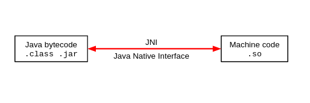

# Native Code

## Why?

- Some components tend to be fast.
- CPU intensive components in C/C++.
- Google discourages its use.

## Makes analysis difficult

- Native code can interfere with the Dalvik code / memory.
- Native code can modify memory data structure (Java code invokes method A but instead it invokes method B).
- No barrier between Java and native code.


## Java ⇔ C/C++ can communicate

- Java can invoke C/C++ methods
- C/C++ methods can invoke Java methods as well!




## Developing native code

**java/com/mobisec/nativecodetest/MainActivity.java**

```
public native String stringFromJNI();

static {
    System.loadLibrary("native-lib");
}
```

**main/cpp/native-lib.cpp**

```
#include <jni.h>
#include <string>

extern "C"
JNIEXPORT jstring JNICALL
Java_com_mobisec_nativecodetest_MainActivity_stringFromJNI(
        JNIEnv* env,
        jobject /* this */) {
    std::string hello = "Hello from C++";
    return env->NewStringUTF(hello.c_str());
}
```

## Example of C/C++ ⇒ Java

```
package my.package;

class MainActivity extends Activity {
	// ...
	public String messageMe(String text) {
		System.out.println(text);
		return text;
	}
	
	public native String getJniString();
}
```

```
jstring Java_my_package_MainActivity_getJniString(JNIEnv* env, jobject obj) {

    jstring jstr = env->NewStringUTF(env, "Created in JNI");
    jclass clazz = env->FindClass(env, "my/package/MainActivity");
    jmethodID messageMe = env->GetMethodID(
        env, clazz, "messageMe", "(Ljava/lang/String;)Ljava/lang/String;");
    jobject result = env->CallObjectMethod(env, obj, messageMe, jstr);

    const char* str = env->GetStringUTFChars(env,(jstring) result, NULL);
    printf("%s\n", str);

    return (*env)->NewStringUTF(env, str);
}
```

## More on native code

- You can create a Native Activity (no Java code at all).
- The shared object file (.so) doesn't need to be embedded in the app:
	- An app can load native libraries from other parts of the file system.
	- Common malware pattern: 1) download from web, 2) load it.
	- But: it needs to start with "lib" and ends with ".so" [link](https://stackoverflow.com/questions/22694163/load-a-custom-so-in-android/22757193#22757193).

## Another way to communicate with C/C++

- Install via SDK manager (NDK and CMake).
- Create a new project and check "C/C++ support".
- It creates a basic app with a basic native code component.

